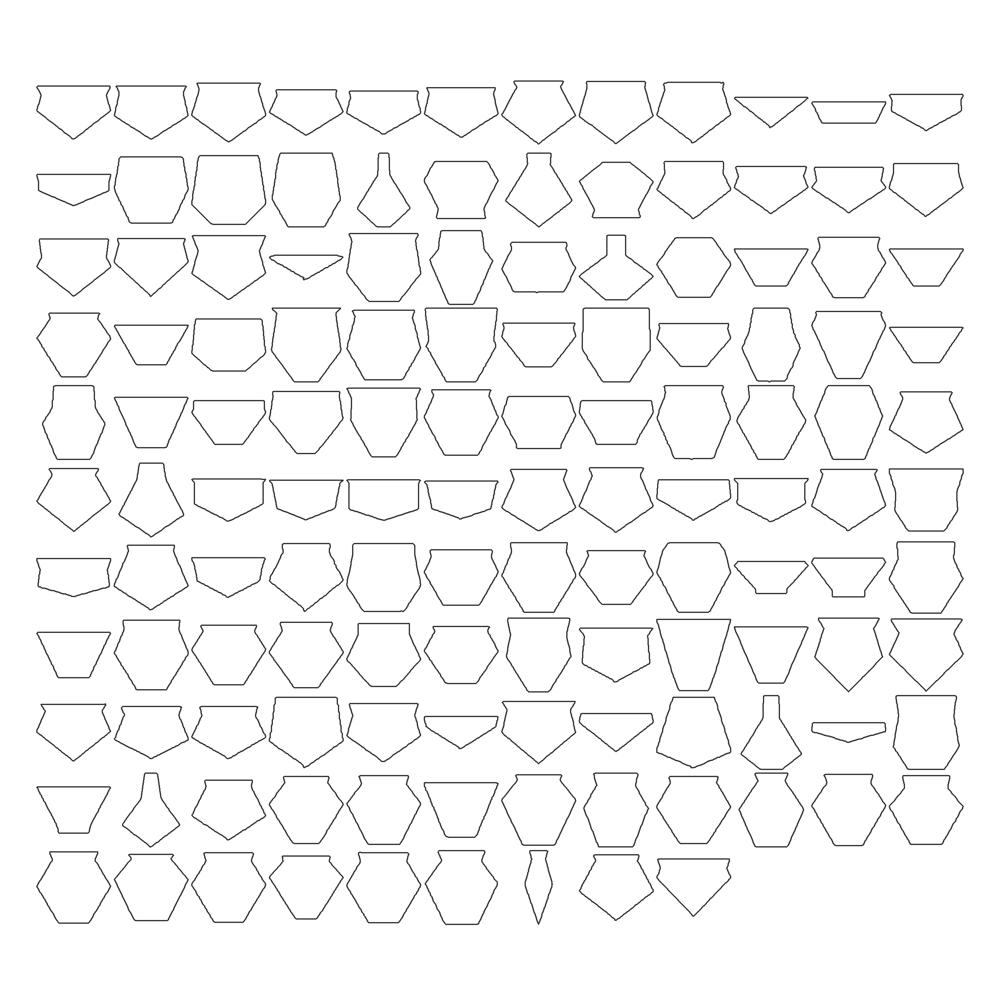
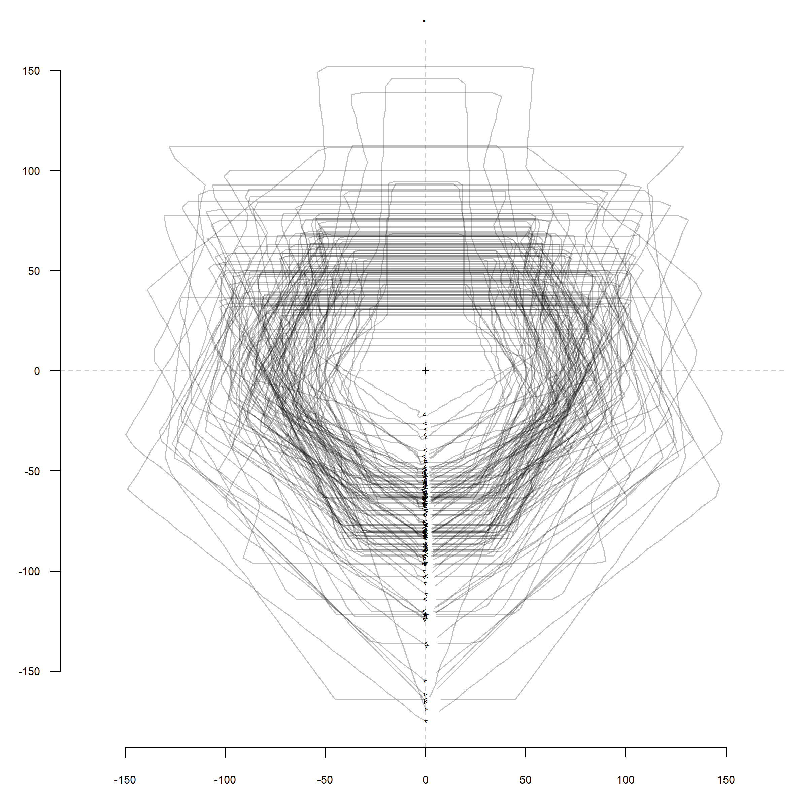

# aSCAC (*Archive des styles de céramique en Afrique centrale*)

**Dirk Seidensticker**

```{r setup, include=FALSE}
library(concaveman)
library(ggplot2)
library(ggthemes)
library(raster)
#library(rgdal)
library(rnaturalearth)
library(sf)
library(spdep)
library(tidyverse)
library(viridis)

land50 <- ne_download(scale = 50, type = "land", category = "physical", returnclass="sf")
rivers50 <- ne_download(scale = 50, type = "rivers_lake_centerlines", category = "physical", returnclass = "sf")
coast50 <- ne_download(scale = 50, type = 'coastline', category = 'physical', returnclass = "sf")
lakes50 <- ne_download(scale = 50, type = "lakes", category = "physical", returnclass="sf")
boundary_lines_land50 <- ne_download(scale = 50, type = 'boundary_lines_land', category = 'cultural', returnclass = "sf")

sites <- data.table::fread("sites.csv", encoding = "UTF-8")  %>%
  st_as_sf(crs = 4326, 
           coords = c("LONG", 
                      "LAT"), 
           remove = FALSE, 
           na.fail = F)

pottery <- data.table::fread("potterygroups.csv", encoding = "UTF-8")

sites.meta <- sites %>% 
  dplyr::left_join(pottery, by = "POTTERY")
```

This repository contains an archive of pottery groups in Central Africa.

The initial version of the data was first published in:

Seidensticker, D., W. Hubau, D. Verschuren, C. Fortes-Lima, P. de Maret, C.M. Schlebusch & K. Bostoen. 2021. Population Collapse in Congo Rainforest from AD 400 Urges Reassessment of the Bantu Expansion. Science Advances 7. https://doi.org/10.1126/sciadv.abd8352. (data: https://github.com/dirkseidensticker/HumActCentralAfrica_Paper)


```{r analysis, include=FALSE}
breaks <- seq(-1000, 2000, 100)
class <- seq(1,length(breaks), 1)
breaks <- data.frame(breaks, class)
for(i in 1:nrow(breaks)){
  breaks[i, "labels"] <- paste0(breaks[i,"class"], ": ", breaks[i,"breaks"], "/", breaks[i+1,"breaks"])
}

# Frequency of sites per pottery group

# pottery.sites.freq <- as.data.frame(stats::aggregate(SITE ~ POTTERY, 
#                                                      data = sites, 
#                                                      FUN = length)) 

pottery.sites.freq <- as.data.frame(
  stats::aggregate(
    LAT + LONG ~ POTTERY, 
    data = sites %>%
      dplyr::distinct(LAT, LONG, POTTERY), 
    FUN = length))

names(pottery.sites.freq) <- c("POTTERY", "SITE")

# Area per pottery group (Convex hull)
# see https://github.com/joelgombin/concaveman

id <- dplyr::filter(pottery.sites.freq, SITE > 2)

pottery.sites.area <- sf::st_multipolygon()
pottery.sites.area <- st_sf(polygons = st_sfc(st_polygon()))
sf::st_crs(pottery.sites.area) <- (4326)
pottery.sites.area$POTTERY <- NA
for(i in 1:nrow(id)){
  sites.f <- dplyr::filter(sites, POTTERY == id[i,1])
  conc.hull <- concaveman(sites.f)
  conc.hull$POTTERY = id[i, "POTTERY"]
  pottery.sites.area <- rbind(pottery.sites.area, conc.hull)
}

pottery.sites.area$AREA <- sf::st_area(pottery.sites.area)
pottery.sites.area$AREA <- as.numeric(pottery.sites.area$AREA)/1E9 # convert m2 into k(ilo) km2

pottery.sites.area <- pottery.sites.area %>%
  dplyr::left_join(pottery, by = "POTTERY")

# Frequency of pottery groups per bin

pottery.cent <- data.frame(matrix(ncol = ncol(pottery)+1, nrow = 0))
x <- c(names(pottery), "CLASS")
colnames(pottery.cent) <- x

for (i in 1:length(pottery$POTTERY)){
  for (j in 1:(nrow(breaks)-1)) {
    if(pottery[i,"TO"] > breaks[j,"breaks"] & 
       pottery[i,"FROM"] < breaks[j+1,"breaks"]){
      l <- pottery[i,]
      l$CLASS <- breaks[j,"labels"]
      pottery.cent <- rbind(pottery.cent, as.data.frame(l))
    }

  }
}
pottery.cent$AGE <- (as.numeric(sub("/.*", "", sub(".*? ", "", pottery.cent$CLASS))) + as.numeric(sub(".*/", "", sub(".*? ", "", pottery.cent$CLASS)))) / 2
pottery.cent$AGE.jitter 	<- jitter(pottery.cent$AGE, 2)

# Frequency of pottery groups per 100 years

pottery.cent.freq <- as.data.frame(table(pottery.cent$AGE))
pottery.cent.freq$Var1 <- as.numeric(as.character(pottery.cent.freq$Var1))

# merge into meta tables

pottery.cent.meta <- pottery.cent %>%
  dplyr::select(-DESCRIPTION) %>%
  dplyr::left_join(pottery.sites.freq, by = "POTTERY") %>%
  dplyr::left_join(pottery.sites.area, by = "POTTERY")

sites.cent <- merge(x = sites, 							# merge sites per style with class (200-year century list)
                    y = dplyr::select(pottery.cent, -DESCRIPTION), 
                    by = "POTTERY", 
                    allow.cartesian = TRUE)


# Distance of sites pertaining to the same style
# see https://github.com/dirkseidensticker/HumActCentralAfrica_Paper/blob/main/response_eLetter_Giresse_etal.Rmd#L95-L159
index <- unique(sites$POTTERY)
res.lst <- list()
for(i in 1:length(index)){
  sel <- dplyr::filter(sites, POTTERY == index[i])
  if(nrow(sel) >= 5){
    sel.cords <- sf::st_coordinates(sel)
    sel.knn <- spdep::knearneigh(sel.cords, 
                                 k = 4, 
                                 longlat = TRUE)

    sel.dist <- spdep::nbdists(
      spdep::knn2nb(sel.knn), 
      sel.cords, 
      longlat =  TRUE
      )

    res.lst[[i]] <- data.frame(POTTERY = index[i], 
                             MEDIAN = median(unlist(sel.dist)))
  }
}
knn.res <- do.call(rbind, res.lst)

pottery.knn <- merge(
  x = pottery, 
  y = knn.res, 
  by = "POTTERY")

breaks <- seq(-1000, 2000, 100)
class <- seq(1,length(breaks), 1)
breaks <- data.frame(breaks, class)
for(i in 1:nrow(breaks)){breaks[i, "labels"] <- paste0(breaks[i,"class"], ": ", breaks[i,"breaks"], "/", breaks[i+1,"breaks"])}

pottery.res <- data.frame(matrix(ncol = ncol(pottery.knn)+1, nrow = 0))
x <- c(names(pottery.knn), "CLASS")
colnames(pottery.res) <- x

for (i in 1:length(pottery.knn$POTTERY)){
  for (j in 1:(nrow(breaks)-1)) {
    if(pottery.knn[i,"TO"] > breaks[j,"breaks"] & 
       pottery.knn[i,"FROM"] < breaks[j+1,"breaks"]){
      l <- pottery.knn[i,]
      l$CLASS <- breaks[j,"labels"]
      pottery.res <- rbind(pottery.res, as.data.frame(l))
    }
  }
}
pottery.res$AGE <- (as.numeric(sub("/.*", "", sub(".*? ", "", pottery.res$CLASS))) + as.numeric(sub(".*/", "", sub(".*? ", "", pottery.res$CLASS)))) / 2
pottery.res$AGE.jitter 	<- jitter(pottery.res$AGE, 2)
```

```{r stats, warning = FALSE, echo = FALSE, fig.dim = c(6, 8), fig.align = 'center', dpi = 300, out.width = '75%', fig.cap="Fig. 1: Evolution of the numerical abundance and geographical distribution of pottery styles in the Congo rainforest over the past 3000 years (see Seidensticker et al. 2021: Fig. 3)."}
freq.plt <- ggplot() + 
  geom_bar(data = pottery.cent.freq, 
           aes(x = Var1, 
               weight = Freq), 
           fill = "white", 
           color = "#333333", 
           width = 75) + 
  scale_x_continuous(expand = c(0, 0)) + 
  scale_y_continuous("Number of  \n pottery groups", 
                     expand = c(0, 0)) + 
  theme_classic() + 
  theme(axis.title.x = element_blank(), 
        axis.text.x = element_blank(), 
        axis.ticks.x = element_blank())

qty.sites.plt <- ggplot() + 
  geom_boxplot(data = pottery.cent.meta, 
               aes(x = AGE, 
                   y = SITE, 
                   group = AGE), 
               outlier.shape = 3, 
               width = 75) + 
  scale_x_continuous(expand = c(0, 0)) + 
  scale_y_sqrt("Number of sites\n per pottery group", 
               expand = c(0, 0)) + 
  theme_classic() + 
  theme(axis.title.x = element_blank(), 
        axis.text.x = element_blank(), 
        axis.ticks.x = element_blank())

area.plt <- ggplot() + 
  geom_boxplot(data = pottery.cent.meta, 
               aes(x = AGE, 
                   y = AREA, 
                   group = AGE), 
               outlier.shape = 3, 
               width = 75) + 
  scale_x_continuous(expand = c(0, 0)) + 
  scale_y_sqrt("Distribution area of \n pottery groups (1000 km^2)", 
               expand = c(0, 0)) + 
  theme_classic() + 
  theme(axis.title.x = element_blank(), 
        axis.text.x = element_blank(), 
        axis.ticks.x = element_blank())

dist.plt <- ggplot(pottery.res, 
       aes(x = AGE.jitter, 
           y = MEDIAN, 
           group = AGE)) +  
  geom_boxplot(outlier.shape = 3, 
               width = 75) + 
  scale_x_continuous("cal BCE/CE", 
                     limits = c(-1000, 1800), 
                     breaks = seq(-1000, 1800, 500)) +
  scale_y_continuous("Median distance (km)", expand = c(0, 0)) + 
  theme_classic()

cowplot::plot_grid(freq.plt, 
                   qty.sites.plt, 
                   area.plt, 
                   dist.plt, 
                   ncol = 1, 
                   align = "v", axis = "lr", 
                   labels = "auto", 
                   rel_heights = c(1, 1, 1, 1.2))
```

```{r map, warning = FALSE, echo = FALSE, fig.align = 'center', fig.dim = c(8, 6), dpi = 300, out.width = '100%', fig.cap="Fig. 2: Map of the distribution areas of pottery styles through time"}

# set label:
lbl <- unique(pottery.cent.meta[,c("AGE", "CLASS")]) %>%
  dplyr::filter(CLASS != "30: 1900/2000")
lbl$CLASS <- sub(".*? ", "", lbl$CLASS)
lbl <- setNames(lbl$CLASS, lbl$AGE)

ggplot() + 
  geom_sf(data = land50, fill = "white", color = NA) + 
  #geom_raster(data = rfs.bd1.7, aes(y = y, x = x), fill = '#00734d') + 
  #geom_raster(data = rfs.bd5, aes(y = y, x = x), fill = '#2b916a') + 
  #geom_raster(data = subset(rfs.bd17, x < 20), aes(y = y, x = x), fill = '#54eeb7') + 
  #geom_raster(data = rfs.bd26, aes(y = y, x = x), fill = '#44afe3') + 
  geom_sf(data = coast50, size = .5, color = 'darkgrey') + 
  geom_sf(data = rivers50, size = .5, color = 'darkgrey') + 
  geom_sf(data = lakes50, fill = 'darkgrey', color = NA) + 
  geom_sf(data = boundary_lines_land50, linewidth = .1, linetype = "dashed", color = 'black') + 
  geom_sf(data = pottery.cent.meta %>%
            dplyr::filter(CLASS != "30: 1900/2000") %>% 
            sf::st_as_sf(), 
          aes(fill = AGE)) + 
  scale_x_continuous(breaks = seq(10, 30, 10)) + 
  scale_y_continuous(breaks = seq(-10, 10, 10)) + 
  scale_fill_viridis() + 
  facet_wrap(AGE ~ .,
             labeller = labeller(AGE = lbl)) + 
  coord_sf(xlim = c(8, 27), 
           ylim = c(-10, 6)) + 
  theme_few() +
  theme(panel.background = element_rect(fill = "#dcdcdc"),
        plot.background = element_rect(color = NA, 
                                       fill = NA), 
        axis.text = element_blank(), 
        axis.ticks = element_blank())
```

## Datasets

> TODO

### sites.csv

A list of sites and the described pottery styles / groups that were found there:

| Datafield | Description |
| --------- | ----------- |
| REGION    | Region (cf. Seidensticker et al. 2021) |
| SITE      | Name of the site |
| LAT       | Latitude    |
| LONG      | Longitude   |
| POTTERY   | Pottery style (cf. `potterygroups.csv`) |
| SOURCE    | Source      |

### potterygroups.csv


| Datafield | Description |
| --------- | ----------- |
| ID        |             |
| POTTERY   | Name of the pottery group / style |
| FROM      | maximum age  |
| TO        | minimal age |
| DESCRIPTION | A description of the chronological arguments of the group (cf. Seidensticker et al. 2021 Data S2) |
| REGION    | Region (cf. Seidensticker et al. 2021) |
| COL       | a hexadecimal color code for plott (cf. Seidensticker 2021 Ch. 5) |


### potterydrawings.csv

This dataset contains a list of drawn pottery sherds and vessels with their sources and as much metadata as could be extracted from the literature. It further contains measurements (cf. Seidensticker 2021, pp. 31-32 Abb. 6).

<p float="left">
  
  
</p>

| Datafield | Description |
| --------- | ----------- |
| SITE      | Name of the site (cf. `site.csv`) |
| FEATURE   |             |
| OBJECT    |             |
| POTTERY   | Pottery style (cf. `potterygroups.csv`) |
| TypeOrig  |             |
| muendungsD | diameter at the mouth |
| muendungsH | height at the mouth (maximal height) |
| minD      | minimal diameter |
| minD_H    | height at the minimal diameter (above base) |
| maxD      | maximum diameter |
| maxD_H    | height at the maximum diameter (above base) |
| bodenD    | diameter of the base |
| SOURCE    | Sourece     |


