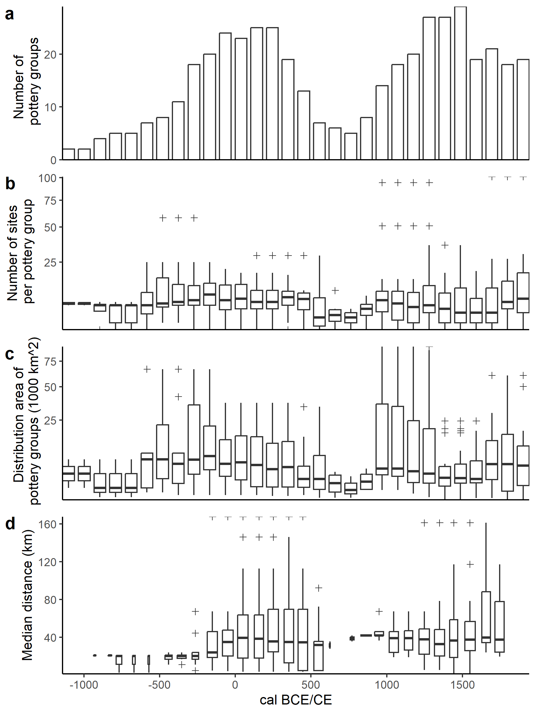
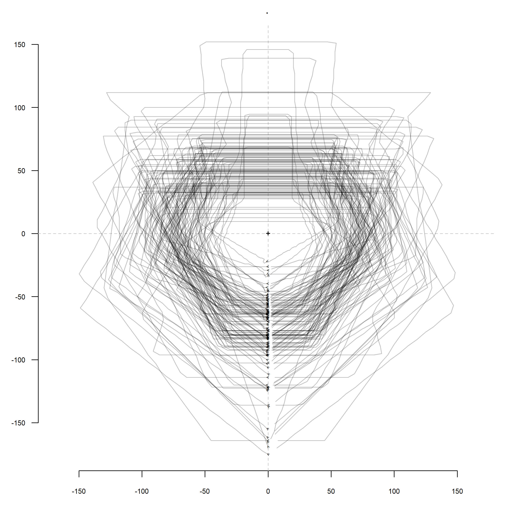

# aSCAC (*Archive des styles de céramique en Afrique centrale*)

**Dirk Seidensticker**

This repository contains an archive of pottery groups in Central Africa.

The initial version of the data was first published in:

Seidensticker, D., W. Hubau, D. Verschuren, C. Fortes-Lima, P. de Maret,
C.M. Schlebusch & K. Bostoen. 2021. Population Collapse in Congo
Rainforest from AD 400 Urges Reassessment of the Bantu Expansion.
Science Advances 7. <https://doi.org/10.1126/sciadv.abd8352>. (data:
<https://github.com/dirkseidensticker/HumActCentralAfrica_Paper>)

## Datasets

> TODO

### sites.csv

A list of sites and the described pottery styles / groups that were
found there:

| Datafield | Description                             |
|-----------|-----------------------------------------|
| REGION    | Region (cf. Seidensticker et al. 2021)  |
| SITE      | Name of the site                        |
| LAT       | Latitude                                |
| LONG      | Longitude                               |
| POTTERY   | Pottery style (cf. `potterygroups.csv`) |
| SOURCE    | Source                                  |

### potterygroups.csv

| Datafield   | Description                                                                                       |
|-------------|---------------------------------------------------------------------------------------------------|
| ID          |                                                                                                   |
| POTTERY     | Name of the pottery group / style                                                                 |
| FROM        | maximum age                                                                                       |
| TO          | minimal age                                                                                       |
| DESCRIPTION | A description of the chronological arguments of the group (cf. Seidensticker et al. 2021 Data S2) |
| REGION      | Region (cf. Seidensticker et al. 2021)                                                            |
| COL         | a hexadecimal color code for plott (cf. Seidensticker 2021 Ch. 5)                                 |

### potterydrawings.csv

This dataset contains a list of drawn pottery sherds and vessels with
their sources and as much metadata as could be extracted from the
literature. It further contains measurements (cf. Seidensticker 2021,
pp. 31-32 Abb. 6).

| Datafield  | Description                                 |
|------------|---------------------------------------------|
| SITE       | Name of the site (cf. `site.csv`)           |
| FEATURE    |                                             |
| OBJECT     |                                             |
| POTTERY    | Pottery style (cf. `potterygroups.csv`)     |
| TypeOrig   |                                             |
| muendungsD | diameter at the mouth                       |
| muendungsH | height at the mouth (maximal height)        |
| minD       | minimal diameter                            |
| minD_H     | height at the minimal diameter (above base) |
| maxD       | maximum diameter                            |
| maxD_H     | height at the maximum diameter (above base) |
| bodenD     | diameter of the base                        |
| SOURCE     | Sourece                                     |
