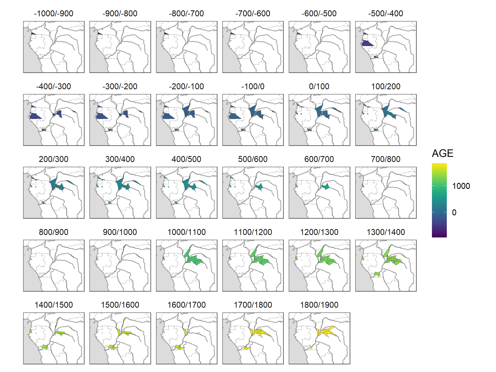

# aSCAC (*Archive des styles de céramique en Afrique centrale*)

**Dirk Seidensticker**

This repository contains an archive of pottery groups in Central Africa.

The initial version of the data was first published in:

Seidensticker, D., W. Hubau, D. Verschuren, C. Fortes-Lima, P. de Maret,
C.M. Schlebusch & K. Bostoen. 2021. Population Collapse in Congo
Rainforest from AD 400 Urges Reassessment of the Bantu Expansion.
Science Advances 7. <https://doi.org/10.1126/sciadv.abd8352>. (data:
<https://github.com/dirkseidensticker/HumActCentralAfrica_Paper>)

Fig. 1: Evolution of the numerical abundance and geographical
distribution of pottery styles in the Congo rainforest over the past
3000 years (see Seidensticker et al. 2021: Fig. 3).

Fig. 2: Map of the distribution areas of pottery styles through time

## Datasets

> TODO

### sites.csv

| Datafield | Description |
|-----------|-------------|

### potterygroups.csv

| Datafield | Description |
|-----------|-------------|
